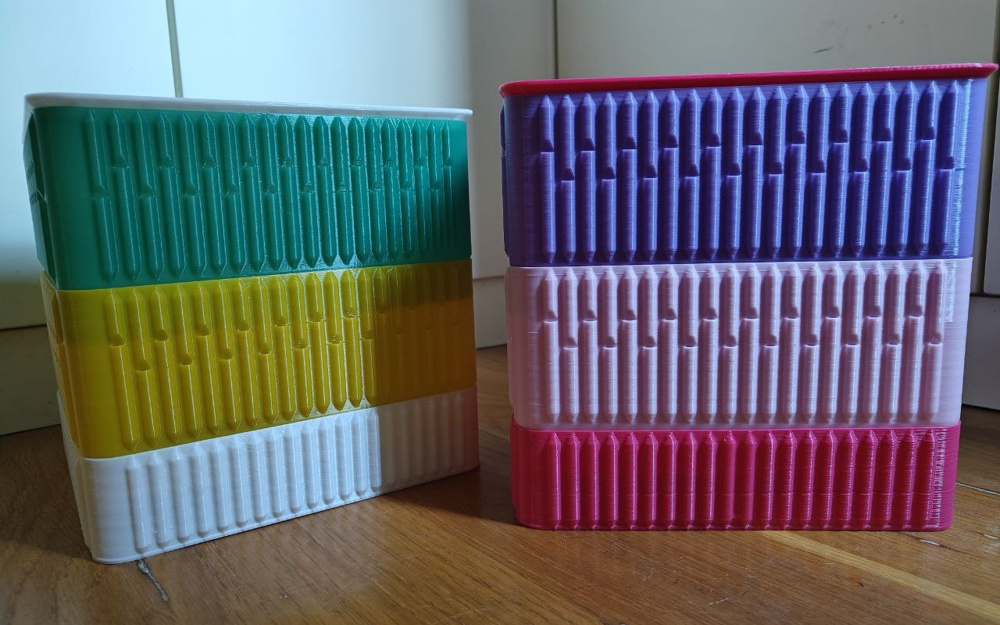

# Ultimate Vermicomposter Generator


The Ultimate Vermicomposter Generator is an open source project that provides a way to generate STL files to 3D print a vermicomposter. This project was inspired by [@hitchhiker4200](https://www.printables.com/es/@hitchhiker4200) design of a [Vase Mode Vermicomposter Compost Bin System](https://www.printables.com/es/model/242869-vase-mode-vermicomposter-compost-bin-system) that I just transformed to a parametrizable one.




## :sparkles: Features
|   |  |  |   |
|---|---|---|---|
|  Any size  |  Structure  | Ventilation holes | Stackable  |
|  You can create a vermicomposter that fits wherever you want  |  Wall structure highly customizable to match your requirements  | Prevent anaerobic processes by using ventilation and put it where you want | Configure the bottom chamfer to make a big stack |


## :muscle: Getting started

The Ultimate Vermicomposter Generator is meant to be used by anyone and it's not neccessary to code, *BUT* you have to touch some values that are in the code. Don't worry, it's easy and very strightforward. Let's start!

### :arrow_down: Download stuff
Fist of all you have to download several things:

1. This repository [by downloading it](https://github.com/RaulBejarano/Ultimate-Vermicomposter-Generator/archive/refs/heads/main.zip) or by cloning it (we assume that if you use this method you know how to do it). Then unzip the files.
2. [OpenSCAD](https://openscad.org/downloads.html): the sofware we need to render and create our STL files.


### :hammer: Creating our first vermicomposter box

Let's start by opening the file [`./examples/xl/xl_mid.scad`](./examples/xl/xl_mid.scad) with OpenSCAD.

You will see some code but we only are interested in the parameters inside the vermicomposter definition. Let's change some of them:
  
This defines a bin:
> :warning: Use milimeters
```
vermicomposter(
    size = [210, 210, 100],
    r = 15,
    con = 5,
    bottom = [2,2,20],
    column_d = 6,
    column_s = 3,  // column separation
    holes_mt = 25,
    holes_var = 12.5
);
```

- `size`: An array that defines the total length, width and height of the bin.
- `r`: The radius of the box corner.
- `con`: The connection space between the union chamfer and the main body.
- `bottom`: Bottom margin that defines the union chamfer.
- `column_d`: Columns are the structure part that gives strength to the wall. This parameter defines their diameter.
- `column_s`: Separation between columns.
- `holes_mt`: Top margin of the column holes.
- `holes_var`: This defines the notch spare.

That's all! Render it with this values with OpenSCAD and you will get something similar to this:

Now it's your turn. Play with the parameters and different lengths, widths, columns, etc. Let's make something awesome!


## Contributing

Feel free to contribute to this project as much as you want.

:children_crossing: If you are new contributing we recommend you to start by playing with the core design file [`vermicomposter.scad`](./vermicomposter.scad).

:memo: When you see something you want to add, modify or refactor first of all, you should **create a new issue** providing as much information as you can. We will appreciate if you can write as an user story (e.g. `AS [a user persona], I WANT [to perform this action] SO THAT [I can accomplish this goal]`.) 

:twisted_rightwards_arrows: Then you should create a fork of the project, clone it to your local, create a new local branch and you will be ready to start making changes. You'll need a recent version of [OpenSCAD.](https://openscad.org/)

:rocket: When you finish making changes go to [pull requests](https://github.com/RaulBejarano/Ultimate-Vermicomposter-Generator/pulls) and create a new one selecting your fork as source. More info on [GitHub Docs: creating a pull request from a fork](https://docs.github.com/es/pull-requests/collaborating-with-pull-requests/proposing-changes-to-your-work-with-pull-requests/creating-a-pull-request-from-a-fork). Please add as much information as you can explaining what have you done, strategies you followed, which issue resolves, etc.

:speech_balloon: Your PR will be commented, reviewed and, we hope, :tada:**approved and merged into main branch**:tada:.

If you want to contribute but you feel lost with all this process please fell free to contact to any of the mantainers, they will help you a lot.
